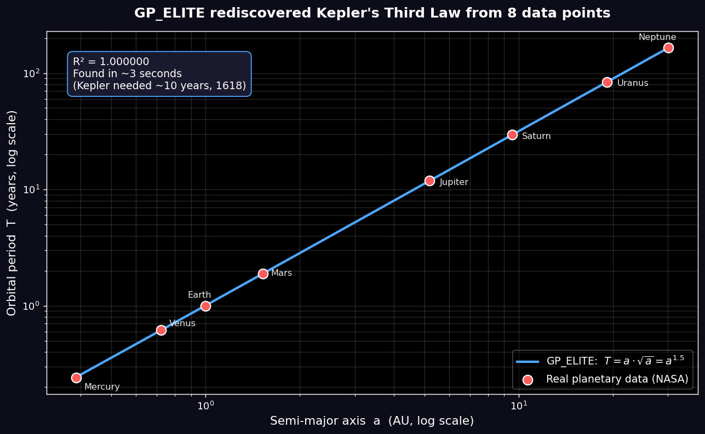

# GP_ELITE

**Régression symbolique par programmation génétique — pour découvrir des lois interprétables sur vos données expérimentales.**

*[🇬🇧 English version](README.md)*


GP_ELITE cherche une **formule mathématique** qui relie vos variables à une cible, au lieu d'une boîte noire. Pensé pour les petits jeux de données expérimentaux (≤10 variables, 100-5000 points) où l'on veut *comprendre* la relation : lois de dégradation, calibration de capteurs, corrélations d'ingénierie, courbes dose-réponse, lois physiques.

Pur **Python / NumPy** — pas de Julia, pas de compilation, pas de GPU. `pip install` et c'est parti.



> À partir des seules distances et périodes orbitales des 8 planètes, GP_ELITE a redécouvert la 3ᵉ loi de Kepler (`T = a·√a = a^1.5`) en quelques secondes — voir [`examples/kepler_demo.py`](examples/kepler_demo.py).

```python
from gp_elite import symbolic_regression

result = symbolic_regression(X, y, feature_names=["cycle", "temperature", "courant"])
print(result.expression)        # capacity_SOH = 0.913 - 0.352·tanh(...)
print(result.r2_validation)     # 0.996  (sur des données jamais vues)
```

---

## Nouveautés 0.2.0

- **Constantes par Levenberg–Marquardt** (défaut) : précision machine — la loi de Coulomb `q1·q2/(4πεr²)` récupérée *exactement* (1−R² ≈ 8e-32). 6–14× plus rapide sur les problèmes à constantes.
- **Fiabilité multi-restart** (`restarts=N`) : runs indépendants sur un hold-out déterministe partagé, archives fusionnées, sélection globale unique.
- **Front de Pareto** (`result.pareto`) : tout l'escalier complexité ↔ précision, chaque entrée avec son `.predict`.
- **Mode Prévision / extrapolation** (`extrapolate_feature=`, `extrapolate_direction=`) : sondes hors-domaine anti-divergence, plancher linéaire, sélection-frontière. Aussi en **mode 7** du menu interactif.
- **Reproductibilité** : résultats identiques à seed égal dans un processus ; entre invocations, lancer avec `PYTHONHASHSEED=0`.

---

## Pourquoi GP_ELITE ?

| | GP_ELITE | Réseaux de neurones | PySR (état de l'art) |
|---|---|---|---|
| Sortie | **formule lisible** | boîte noire | formule lisible |
| Installation | `pip install` (pur Python) | lourde | nécessite **Julia** |
| Validation anti-surapprentissage | **intégrée** (hold-out) | à faire soi-même | à faire soi-même |
| Sélection de variables | **rapport d'importance** | non | partielle |

La niche de GP_ELITE : **zéro barrière d'entrée**. Un ingénieur de labo, un étudiant ou un technicien pointe un fichier CSV et reçoit une loi validée, sans devenir développeur.

---

## Installation

```bash
pip install gp-elite          # depuis PyPI
# ou, depuis les sources :
git clone https://github.com/ariel95500-create/gp-elite
cd gp-elite && pip install -e .
```

Dépendances : `numpy`, `pandas`, `scikit-learn`.

---

## Utilisation

### En une ligne, sur vos données (interface graphique en console)

```bash
gp-elite
```

Choisissez le mode **6 (CSV générique)**, indiquez votre fichier, et laissez les valeurs par défaut. GP_ELITE détecte les colonnes, sépare un jeu de validation, évolue, et affiche la loi trouvée avec son rapport de généralisation.

### Par programmation (notebooks, pipelines)

```python
import numpy as np
from gp_elite import symbolic_regression

X = np.random.uniform(1, 5, (200, 2))
y = 2.0 + 3.0 * np.sqrt(X[:, 0]) - 0.5 * X[:, 1]

result = symbolic_regression(
    X, y,
    feature_names=["a", "b"],
    operators="physical",   # 'physical' | 'trig' | 'full' | 'poly'
    generations=60,
    speed="fast",           # 'ultrafast' | 'fast' | 'normal'
)

print(result.expression)        # ex : 2.0 + 3.0·sqrt(a) - 0.5·b
print(result.r2_validation)     # qualité sur le hold-out
print(result.size)              # nombre de nœuds (lisibilité)
```

---

## 🛡️ Régression robuste (loss personnalisée résistante aux outliers)

Les données réelles sont bruitées. Quelques points aberrants suffisent à faire dévier un ajustement aux moindres carrés loin de la vraie relation. GP_ELITE propose un **mode robuste** activable par un seul paramètre, qui retrouve la *vraie* loi même quand une fraction notable des données est corrompue.

```python
from gp_elite import symbolic_regression

# X, y : vos données (potentiellement bruitées)
result = symbolic_regression(X, y, feature_names=["x"], robust=True)
print(result.expression)
```

En interne, `robust=True` bascule l'objectif vers une **loss de Huber** et recale les coefficients finaux par **IRLS (moindres carrés repondérés itérativement)** : l'ajustement est piloté par la masse des données, pas par quelques points extrêmes. Le résultat reste une formule compacte et lisible.

**Comportement mesuré** (récupération de `y = 2x + 1` — RMSE contre la *vraie* loi sur les points propres, plus bas = meilleur) :

| outliers | MSE (défaut) | `robust=True` |
|---------:|-------------:|--------------:|
|      0 % |        0.063 |         0.063 |
|     10 % |        1.398 |         1.374 |
|     20 % |        1.925 |     **0.543** |

Sur données propres, le MSE ordinaire gagne d'un cheveu — **la robustesse n'est pas gratuite**. Avec 10–20 % d'outliers, le mode robuste retrouve la vraie loi là où le MSE déraille. Utilisez `robust=True` quand vous soupçonnez des valeurs aberrantes dans vos données.

Voir [`examples/robust_regression.py`](examples/robust_regression.py) pour le benchmark complet et reproductible.

---

## Exemple complet : dégradation de batterie (données NASA)

```bash
python examples/battery_soh.py
```

À partir de 168 cycles réels, GP_ELITE découvre une loi de l'état de santé (SOH) :

```
capacity_SOH ≈ 0.913 − 0.352 · tanh( cycle^((temperature/cycle)^0.485) )

R² validation = 0.996   (sur des cycles jamais vus)   12 nœuds
```

Une dégradation saturante avec les cycles, modulée par la température — physiquement plausible, et **certifiée sur des données non vues**.

---

## Sur quoi GP_ELITE est-il bon (et moins bon) ?

**Bon** : lois physiques / d'ingénierie à structure multiplicative ou exponentielle, données expérimentales bruitées de taille modeste, problèmes où l'interprétabilité prime.

Sur le **benchmark Feynman gelé** (15 équations, `PYTHONHASHSEED=0`, `restarts=4`) : **10/15 récupérations symboliques exactes (67 %)** à précision machine (1−R² < 1e-9), **14/15 sous 1e-3 (93 %)**. Face-à-face contre **gplearn** (mêmes données/splits, budget généreux pour gplearn) : **67 % vs 40 %** d'exact — GP_ELITE devant sur 9 équations, égalité sur 5, derrière sur 1. Prévision sur données réelles (SOH batterie NASA, vraie extrapolation sur cycles jamais vus) : R² médian **+0.52** contre +0.34 pour la régression linéaire, zéro modèle divergent. Reproduire : `PYTHONHASHSEED=0 python benchmarks/feynman_bench.py 0 15` et `benchmarks/duel.py`.

**Moins bon** : suites chaotiques (ex. temps de vol de Collatz — composante intrinsèquement aléatoire), >15-20 variables (l'espace de recherche explose), gros jeux de données où la précision pure prime sur l'interprétabilité (les modèles d'ensemble dominent alors).

---

## Caractéristiques techniques

- **Modèle en îles asymétriques** (explorer / cleaner / stigmergic) avec migration périodique
- **Linear scaling** (Keijzer 2003) : le moteur cherche la *forme*, les coefficients d'échelle sont résolus en forme fermée
- **Sélection ε-lexicase** (La Cava 2016) pour préserver la diversité comportementale
- **Parallélisme des îles** (multi-cœurs) — ≈ ×3 mesuré sur 4 cœurs
- **Validation hold-out** + sélection parcimonieuse du champion (tolérance R²) : anti-surapprentissage intégré
- **Normalisation shift-free** préservant la structure multiplicative (x·y reste un produit propre)
- **Mémoire stigmergique transférable** entre exécutions (export/import de grammaires)

---

## Tests

```bash
pip install pytest
pytest -q
```

---

## Licence

MIT — voir [LICENSE](LICENSE). Utilisation libre, y compris commerciale, avec conservation de la notice de copyright.

## Citer GP_ELITE

Si GP_ELITE vous est utile dans un travail académique, voir [CITATION.cff](CITATION.cff).
