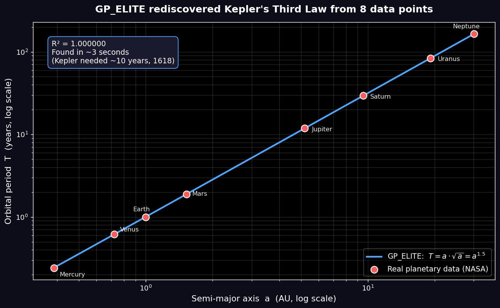

# GP_ELITE
**Genetic-programming symbolic regression — discover interpretable laws from your experimental data.**

Declare your units and the search only ever builds dimensionally valid equations — a hard
constraint, not a soft penalty. The operating envelope is measured, not claimed: how many
points it needs, how much noise it tolerates, and where it fails.

*[🇫🇷 Version française](README.fr.md)*
[](https://colab.research.google.com/github/ariel95500-create/gp-elite/blob/main/examples/quickstart.ipynb) **Try it in your browser** — no install, five steps, fifteen minutes.

GP_ELITE searches for a **mathematical formula** linking your variables to a target, instead of a black box. It is built for small experimental datasets (≤10 variables, 100–5000 points) where you want to *understand* the relationship: degradation laws, sensor calibration, engineering correlations, dose–response curves, physical laws.

Since **0.4 "Lawful"** you can also declare the physical units of your columns — the search itself then only ever builds dimensionally sound expressions, instead of formulas that fit the numbers while breaking the physics (see *Dimensional constraints* below).

Pure **Python / NumPy** — no Julia, no compilation, no GPU. `pip install` and you're ready.



> Given only the 8 planets' distance and orbital period, GP_ELITE rediscovered Kepler's Third Law (`T = a·√a = a^1.5`) in seconds — see [`examples/kepler_demo.py`](examples/kepler_demo.py).

```python
from gp_elite import symbolic_regression

result = symbolic_regression(X, y, feature_names=["cycle", "temperature", "current"])
print(result.expression)        # capacity_SOH = 0.913 - 0.352·tanh(...)
print(result.r2_validation)     # 0.996  (on data never seen during training)
```

---

---

## Is this for you?

You probably want GP_ELITE if **at least one** of these is true:

- **You have a table of measurements and want the formula, not a prediction.**
  A degradation curve, a sensor calibration, an engineering correlation. You care
  about the *shape* of the relationship, and you intend to read it, sanity-check
  it, maybe publish it.
- **You cannot install a second language runtime.** A locked-down university
  machine, a corporate laptop without admin rights, a CI container you do not
  control. `pip install gp-elite` and its three dependencies are all you need —
  no compiler, no Julia, no GPU.
- **You know the physical units of your columns.** Declare them and the search
  will only ever build dimensionally sound formulas — and can tell you the units
  *and value* of a physical constant that is not in your data at all.
- **You are teaching or learning genetic programming.** The engine is plain
  Python you can read, step through and modify, and it ships with an interactive
  console that needs no code at all.

If none of these fit, other tools may serve you better — `PySR` and `Operon` are
faster and more accurate at scale, and this README says so plainly further down.

---

## Installation

```bash
pip install gp-elite          # from PyPI
# or, from source:
git clone https://github.com/ariel95500-create/gp-elite
cd gp-elite && pip install -e .
```

Dependencies: `numpy`, `pandas`, `scikit-learn`.

---

## Usage

### One line, on your own data (console UI)

```bash
gp-elite
```

Choose mode **6 (generic CSV)**, point to your file, and keep the defaults. GP_ELITE detects the columns, holds out a validation set, evolves, and prints the discovered law with its generalization report.

Since 0.6, mode 6 also asks for the **physical units** of your columns. Declaring
them is optional, and skipping is one keystroke — but if you do declare them, the
search is restricted to dimensionally consistent formulas, and the engine can
deduce the units and value of a missing physical constant. On a two-column CSV of
Hooke's law it returns:

```
  Units for ['elongation'], comma-separated : m
  Unit for TARGET 'force' : N
  Deduce an unknown constant? [y/N] : y
  ...
  Deduced constant units : [kg / s^2]
  Deduced constant value : 250
```

Everything the `units=` API offers is now reachable without writing Python.

### Programmatically (notebooks, pipelines)

```python
import numpy as np
from gp_elite import symbolic_regression

X = np.random.uniform(1, 5, (200, 2))
y = 2.0 + 3.0 * np.sqrt(X[:, 0]) - 0.5 * X[:, 1]

result = symbolic_regression(
    X, y,
    feature_names=["a", "b"],
    operators="physical",   # 'physical' | 'trig' | 'full' | 'poly'
    generations=60,
    speed="fast",           # 'ultrafast' | 'fast' | 'normal'
)

print(result.expression)        # e.g. 2.0 + 3.0·sqrt(a) - 0.5·b
print(result.r2_validation)     # quality on the hold-out set
print(result.size)              # node count (readability)
```

---

## 🛡️ Robust regression (outlier-resistant custom loss)

Real-world data is dirty. A handful of outliers can drag an ordinary least-squares fit far from the true relationship. GP_ELITE ships a one-switch **robust mode** that fits the *true* law even when a sizeable fraction of the data is corrupted.

```python
from gp_elite import symbolic_regression

# X, y : your (possibly dirty) data
result = symbolic_regression(X, y, feature_names=["x"], robust=True)
print(result.expression)
```

Under the hood, `robust=True` switches the objective to a **Huber loss** and rescales the final coefficients with an **IRLS (Iteratively Reweighted Least Squares)** procedure, so the fit is governed by the bulk of the data rather than by a few extreme points. It stays a compact, readable formula.

**Measured behaviour** (recovering `y = 2x + 1` — RMSE against the *true* law on clean points, lower is better):

| outliers | MSE (default) | `robust=True` |
|---------:|--------------:|--------------:|
|      0 % |         0.063 |         0.063 |
|     10 % |         1.398 |         1.374 |
|     20 % |         1.925 |     **0.543** |

With clean data, ordinary MSE wins by a hair — **robustness isn't free**. With 10–20 % outliers, robust mode recovers the true law while plain MSE derails. Use `robust=True` when you suspect your data contains outliers.

See [`examples/robust_regression.py`](examples/robust_regression.py) for the full reproducible benchmark.

---

## ⚖️ Dimensional constraints (physical laws only)

Declare the units of your inputs and target, and GP_ELITE will only search
expressions that are dimensionally sound — no more formulas that fit the numbers
while being physically meaningless.

```python
from gp_elite import GPEliteRegressor

est = GPEliteRegressor(
    units=["kg", "m/s"],      # units of X0, X1
    target_units="J",         # unit of the target
)
est.fit(X, y)
```

Units accept plain strings — SI bases (`m kg s A K mol cd`), common derived units
(`N J W Pa Hz C V ohm T`), and `* / ^ ( )`: `"m/s"`, `"kg*m/s^2"`, `"s^-1"`,
`"1"` for dimensionless. Dimension dicts (`{"m": 1, "s": -1}`) work too, as do
per-name (`{"X0": "kg"}`) and per-index (`{0: "kg"}`) forms.

**Measured effect** — Feynman II.11.3, `x = q·Ef/(m·(w0²−w²))`, 5 variables,
5 seeds, 40 generations, identical budget per arm:

| | no `units=` | `units=` | no `units=`, 4x generations |
|---|---:|---:|---:|
| dimensionally valid | **0 / 5** | **5 / 5** | 0 / 5 |
| median test R² | 0.99037 | **0.99786** | 0.99494 |
| median model size | 58 nodes | **22 nodes** | 67 nodes |
| median seconds / run | 18 | 76 | 71 |

The third column gives the unconstrained arm four times the generations, so both
arms cost the same wall-clock time. It still yields **0/5** physically valid
models, and larger ones: compute does not substitute for the constraint. The
unconstrained failures are not marginal — they add hertz to dimensionless numbers,
or raise a quantity to the power of a frequency.

**What it does *not* do.** On a test set drawn *outside* the training domain
(pushing w/w0 from [0.20, 0.67] towards resonance at [0.70, 0.90]), every arm
collapses — median R² 0.26, 0.34 and 0.37 respectively. At these budgets **no arm
recovers II.11.3 exactly**: `units=` buys physically coherent, compact
approximations, not the law itself. Reproduce both tables with
`benchmarks/ab_ood.py`.

**When to use it.** For discovering physical laws when you know the units and the
law is dimensionally homogeneous, and to guarantee that whatever the engine returns
is at least physically meaningful. **Not** for black-box prediction: the constraint
rules out dimensionally wrong but numerically good approximations, so it can *lower*
R² when fitting is the goal rather than finding a law.

**Laws with a dimensioned constant** (`unknown_constant=`). By default, fitted
constants are dimensionless — the AI Feynman convention — which puts a law like
Hooke's `F = k·x` out of reach: no dimensionless constant can relate metres to
newtons, and the search correctly reports that nothing valid can be built. Set
`unknown_constant=True` and the leading constant is allowed to *carry* a
dimension, deduced by homogeneity:

```python
est = GPEliteRegressor(units=["m"], target_units="N", unknown_constant=True)
est.fit(X, y)
est.constant_units_string()   # '[kg / s^2]'
est.constant_value_           # 250.0
```

The engine then reports not only the shape of the law but the **units and value
of the missing physical constant**. Measured on three reference laws, 20
generations, one restart:

| law | structure recovered | deduced units | value | true |
|---|---|---|---|---|
| Hooke `F = k·x` | yes | `kg / s²` | 250.0 | 250 |
| Newton `F = G·m₁·m₂/r²` | yes | `m³ / kg s²` | 6.674e-11 | 6.674e-11 |
| ideal gas `P = nRT/V` | yes | `kg m² / K mol s²` | 8.31446 | 8.314463 |

Reproduce with `benchmarks/test_constante_mystere.py`. Requires `units=` and
`target_units=`. If the expression is not a monomial in the input columns
(`m₁ + m₂`, say), no single raw constant exists and `constant_value_` is `None`
while the deduced units remain valid.

**Limitations.** Under `units=` the internal linear scaling is multiplicative
only (no additive offset), which keeps every candidate dimensionally homogeneous.
Constants are reported in the raw units of the input columns: the equation string
shows the value in the engine's normalised space, `constant_value_` shows the
physical one.

---

## Full example: battery degradation (NASA data)

```bash
python examples/battery_soh.py
```

From 168 real charge cycles, GP_ELITE discovers a state-of-health (SOH) law:

```
capacity_SOH ≈ 0.913 − 0.352 · tanh( cycle^((temperature/cycle)^0.485) )

R² validation = 0.996   (on cycles never seen)   12 nodes
```

A saturating degradation with cycle count, modulated by temperature — physically plausible, and **certified on unseen data**.

---

## Is it solid?

A fair question for a project you have never heard of. Here is where it stands
against the alternatives, and where it does not.

| | GP_ELITE | Neural networks | PySR (state of the art) |
|---|---|---|---|
| Output | **readable formula** | black box | readable formula |
| Installation | `pip install` (pure Python) | heavy | requires **Julia** |
| Overfitting guard | **built-in** (hold-out) | do it yourself | do it yourself |
| Physical validity | **enforced during search** (`units=`) | no | no |
| Variable selection | **importance report** | no | partial |

GP_ELITE's niche: **zero barrier to entry**. A lab engineer, a student, or a technician points at a CSV file and gets a validated law back — without becoming a developer.

---

## What is GP_ELITE good (and less good) at?

**Good at**: physical / engineering laws with multiplicative or exponential structure, modest-size noisy experimental data, problems where interpretability matters most.

On the frozen **Feynman benchmark** (15 physics equations, `PYTHONHASHSEED=0`, `restarts=4`): **10/15 exact symbolic recoveries (67%)** at machine precision (1−R² < 1e-9), **14/15 within 1e-3 (93%)**. Head-to-head against **gplearn** on identical data/splits (generous budget for gplearn): **67% vs 40%** exact — GP_ELITE ahead on 9 equations, tied on 5, behind on 1. Real-data forecasting (NASA battery SOH, true extrapolation on unseen cycles): median R² **+0.52** vs +0.34 for linear regression, with zero divergent models. Reproduce: `PYTHONHASHSEED=0 python benchmarks/feynman_bench.py 0 15` and `benchmarks/duel.py`.

**Less good at**: chaotic sequences (e.g. Collatz flight time — an intrinsically random component), >15–20 variables (the search space explodes — though `units=` substantially narrows it when physical units are known), large datasets where raw accuracy outweighs interpretability (ensemble models dominate there).

---

## Technical features

- **Mystery-constant deduction** (v0.5): the leading constant may carry a dimension, inferred by homogeneity; units and raw value exposed on the estimator
- **Dimensionally-constrained search** (v0.4): constructive typed generation, dimension-preserving mutation and crossover, validity gate in `fitness()`
- **Scale-only linear scaling under `units=`** (v0.4.1): regression through the origin, so the form that is *scored* is the form that is *delivered*
- **Numerical guard in the LM optimizer** (v0.4): no more float64 overflow on unbounded `sq`/`cube`/`*` chains
- **Post-hoc dimensional audit** (v0.3): `dimensions.py` — the very same algebra the constrained search uses, so auditor and engine cannot diverge
- **Levenberg–Marquardt constant optimization** (v0.2): closed-form-quality constants, deterministic, LM/Adam switchable
- **Multi-restart + merged candidate archives** (v0.2): seed variance turned into reliability
- **Pareto front API** (v0.2): non-dominated complexity/accuracy staircase
- **Guarded extrapolation / forecasting mode** (v0.2): beyond-domain probes, linear floor, frontier selection
- **Composition motif seeding** (v0.2): Pythagorean, reciprocal-sum, Gaussian templates for nested structures
- **Asymmetric island model** (explorer / cleaner / stigmergic) with periodic migration
- **Linear scaling** (Keijzer 2003): the engine searches for the *shape*; scale and offset coefficients are solved in closed form
- **ε-lexicase selection** (La Cava 2016) to preserve behavioral diversity
- **Island parallelism** (multi-core) — ≈ ×3 measured on 4 cores
- **Hold-out validation** + parsimonious champion selection (R² tolerance): built-in overfitting guard
- **Shift-free normalization** preserving multiplicative structure (x·y stays a clean product)
- **Transferable stigmergic memory** across runs (grammar export/import)

---

## What's new

**0.6 "Bench"** — physical units are now available from the interactive console
(mode 6), not just the Python API. **0.5 "Unknown"** — the engine deduces the
units *and* value of a law's missing physical constant. **0.4 "Lawful"** —
dimensionally-constrained search. **0.3 "Trust"** — diagnostics and stability.

Full history, with the measurements behind each claim, in
[CHANGELOG.md](CHANGELOG.md).

## Did it fail on your data? Please say so

GP_ELITE is tuned on published benchmarks — Feynman, Strogatz — which are clean,
noise-free and well-scaled. Real measurements are none of those things, and that
gap is where the engine most needs work.

So if it returns nonsense on your data, that is **useful information, not user
error**. [Open an issue](https://github.com/ariel95500-create/gp-elite/issues/new/choose)
with the shape of your data and what you got back. You do not need to share the
data itself, you do not need to know why it failed, and you can write in English
or French.

Failure reports on real measurements are the single most valuable contribution
this project can receive.

---

## Tests

```bash
pip install pytest
pytest -q
```

---

## License

MIT — see [LICENSE](LICENSE). Free to use, including commercially, with retention of the copyright notice.

## Citing GP_ELITE

If GP_ELITE is useful in academic work, see [CITATION.cff](CITATION.cff).
