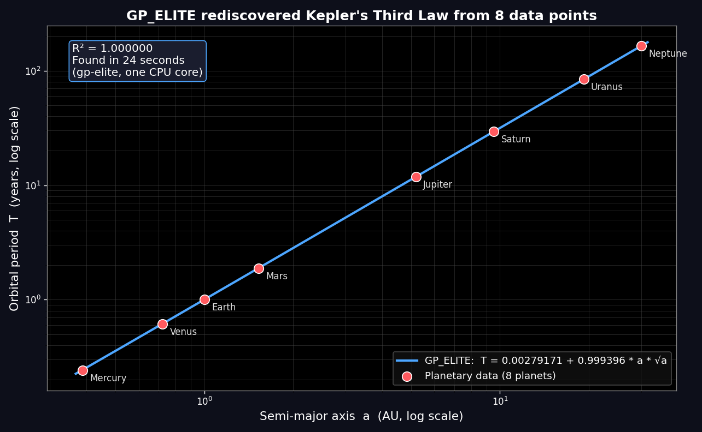

# GP_ELITE
**Genetic-programming symbolic regression — discover interpretable laws from your experimental data.**

Declare your units and the search only ever builds dimensionally valid equations — a hard
constraint, not a soft penalty. The operating envelope is measured, not claimed: how many
points it needs, how its runtime grows, and where it fails.

*[🇫🇷 Version française](README.fr.md)*
[](https://colab.research.google.com/github/ariel95500-create/gp-elite/blob/main/examples/quickstart.ipynb) **Try it in your browser** — no install, five steps, fifteen minutes.

GP_ELITE searches for a **mathematical formula** linking your variables to a target, instead of a black box. It is built for small experimental datasets (≤10 variables) where you want to *understand* the relationship: degradation laws, sensor calibration, engineering correlations, dose-response curves, physical laws.

On five Feynman equations, the returned model recovers the exact law in 4 cases out of 5 at every size from 500 to 10,000 points, and in 12 runs out of 15 at each size from 50 to 200 points (9 out of 15 at 25 points); the median runtime grows about 2.5-fold from 1,000 to 10,000 points (`benchmarks/feynman_scaling.py`, version 0.7.0).

Since **0.4 "Lawful"** you can also declare the physical units of your columns — the search itself then only ever builds dimensionally sound expressions, instead of formulas that fit the numbers while breaking the physics (see *Dimensional constraints* below).

Pure **Python / NumPy** — no Julia, no compilation, no GPU. `pip install` and you're ready.



> Given only the 8 planets' distance and orbital period, GP_ELITE rediscovered Kepler's Third Law, `T = a·√a = a^1.5` — see [`examples/kepler_demo.py`](examples/kepler_demo.py).

```python
import numpy as np
from gp_elite import symbolic_regression

a = np.array([0.387, 0.723, 1.000, 1.524, 5.203, 9.537, 19.191, 30.069])   # AU
T = np.array([0.241, 0.615, 1.000, 1.881, 11.862, 29.457, 84.011, 164.79])  # years

result = symbolic_regression(a.reshape(-1, 1), T, feature_names=["a"], generations=40, seed=0)
print(result.expression)     # 0.00279171 + 0.999396 * a * sqrt(a)
```

The formula is written in *your* variables and units: in astronomical units and years,
Kepler's constant is 1, and that is what comes back.

---

## Is this for you?

You probably want GP_ELITE if **at least one** of these is true:

- **You have a table of measurements and want the formula, not a prediction.**
  A degradation curve, a sensor calibration, an engineering correlation. You care
  about the *shape* of the relationship, and you intend to read it, sanity-check
  it, maybe publish it.
- **You cannot install a second language runtime.** A locked-down university
  machine, a corporate laptop without admin rights, a CI container you do not
  control. `pip install gp-elite` and its three dependencies are all you need —
  no compiler, no Julia, no GPU.
- **You know the physical units of your columns.** Declare them and the search
  will only ever build dimensionally sound formulas — and can tell you the units
  *and value* of a physical constant that is not in your data at all.
- **You are teaching or learning genetic programming.** The engine is plain
  Python you can read, step through and modify, and it ships with an interactive
  console that needs no code at all.

If none of these fit, other tools may serve you better: `PySR` and `Operon` are
faster and more accurate at scale — see *Is it solid?* below.

---

## Installation

```bash
pip install gp-elite          # from PyPI
# or, from source:
git clone https://github.com/ariel95500-create/gp-elite
cd gp-elite && pip install -e ".[test]"
```

Dependencies: `numpy`, `pandas`, `scikit-learn`. Python 3.9 to 3.14, tested on Linux and Windows.

---

## Usage

### One line, on your own data (console UI)

```bash
gp-elite
```

Choose mode **6 (generic CSV)**, point to your file, and keep the defaults. GP_ELITE detects the columns, holds out a validation set, evolves, and prints the discovered law — written in your own column names and units, checked against its own predictions on your data.

Mode 6 also asks for the **physical units** of your columns. Declaring
them is optional, and skipping is one keystroke — but if you do declare them, the
search is restricted to dimensionally consistent formulas, and the engine can
deduce the units and value of a missing physical constant. On a two-column CSV of
Hooke's law it returns:

```
  Units for ['elongation'], comma-separated : m
  Unit for TARGET 'force' : N
  Deduce an unknown constant? [y/N] : y
  ...
  Formula in YOUR columns (checked on your data):
    force = 250 * elongation
  Deduced constant units : [kg / s^2]
  Deduced constant value : 250
```

### Programmatically (notebooks, pipelines)

```python
import numpy as np
from gp_elite import symbolic_regression

rng = np.random.RandomState(0)
X = rng.uniform(1, 5, (200, 2))
y = 2.0 + 3.0 * np.sqrt(X[:, 0]) - 0.5 * X[:, 1]

if __name__ == "__main__":        # needed in scripts, see the note below
    result = symbolic_regression(
        X, y,
        feature_names=["a", "b"],
        operators="physical",     # 'physical' | 'trig' | 'full' | 'poly' | 'conserve'
        generations=60,
        speed="fast",             # 'ultrafast' | 'fast' | 'normal' | 'thorough'
        seed=0,
    )
    print(result.expression)      # 4.69402 + 1.25599 * (0.201558 * a - 0.400369 * b + tanh(0.201558 * a)² + log(a))
    print(result.r2_validation)   # 0.999987
    print(result.size)            # 16
    print(result.sympy())         # the same formula, parsable by sympy
```

At this budget the search returns an approximation, not the law it was given: the `b`
term is right (1.25599 × −0.400369 ≈ −0.503·b), while `3·√a` is approximated by a
combination of `a`, `tanh(a)²` and `log(a)` — a formula that fits the hold-out to
R² 0.99999 and is still not the law. Reading the formula is how you find out;
`restarts=` and `speed="thorough"` spend more compute on the exact form, without a
guarantee.

- `speed`: `'ultrafast' | 'fast' (default) | 'normal' | 'thorough'`. `'thorough'`
  (population 400, four islands, 200 generations) is the regime for looking for an
  exact law; it is several times slower.
- `time_limit=` (seconds): the search stops cleanly at the deadline and returns the
  best model found so far, instead of being killed without a result.
- `restarts=`: independent evolutions whose candidates are merged before the final
  choice — the most effective lever when the budget allows it.

**Scripts and parallel islands.** On machines with four cores or more, islands run
in parallel worker processes. Those workers are started with `spawn` on every
system (Linux included) and re-import your script, so keep the top-level code
under `if __name__ == "__main__":`, as above.
Without the guard GP_ELITE detects the situation, finishes on one core with the
same result, and says so once. Notebooks need nothing.

### Reading the result

- **`expression` is written in your variables.** The engine searches on rescaled
  columns internally; the formula it returns has the rescaling folded back into its
  constants, and the fit checks that the formula reproduces `predict()` on your
  data (`result.formula_exact`). `result.sympy()` gives the same formula as a
  string `sympy.sympify` can parse. (Before 0.7, the displayed constants were
  those of the internal scaled space.)
- **`r2_validation` is a selection score.** The hold-out it is computed on is also
  used to choose the returned model among the candidates, so it is optimistic.
  To estimate how the formula generalises, keep a test set of your own out of the
  fit.
- **`result.pareto`** lists the other non-dominated candidates, simplest first,
  each with its own `expression`, `r2_validation` and `predict`.

---

## 🛡️ Robust regression (outlier-resistant custom loss)

Real-world data is dirty. A handful of outliers can drag an ordinary least-squares fit far from the true relationship. GP_ELITE ships a one-switch **robust mode** meant to follow the bulk of the data rather than a few extreme points.

```python
result = symbolic_regression(X, y, feature_names=["x"], robust=True)
```

Under the hood, `robust=True` switches the objective to a **Huber loss** and rescales the final coefficients with an **IRLS (Iteratively Reweighted Least Squares)** procedure. It stays a compact, readable formula.

**Measured behaviour** (recovering `y = 2x + 1`; RMSE against the *true* law on the clean points, lower is better; five seeds, median and worst seed):

| outliers | default (MSE) | `robust=True` |
|---------:|--------------:|--------------:|
|      0 % |   0.063 [0.063] |   0.063 [0.063] |
|     10 % |   1.398 [1.398] | **0.237** [0.237] |
|     20 % |   1.925 [1.925] |   1.925 [1.925] |

On clean data both modes return the same model. With 10 % outliers, robust mode cuts
the error six-fold. With 20 %, on this example, it does no better than the default: all
five seeds converge to the same line in both modes. Robustness is a tool to try when
you suspect outliers, not a guarantee — compare both modes on data of your own.
(Up to 0.6 this table reported the best of three runs, picked by comparing with the
true law, which no user can do.)

Reproduce: `python examples/robust_regression.py`.

---

## ⚖️ Dimensional constraints (physical laws only)

Declare the units of your inputs and target, and GP_ELITE will only search
expressions that are dimensionally sound — no more formulas that fit the numbers
while being physically meaningless.

```python
from gp_elite import GPEliteRegressor

est = GPEliteRegressor(
    units=["kg", "m/s"],      # units of X0, X1
    target_units="J",         # unit of the target
)
est.fit(X, y)
```

Units accept plain strings — SI bases (`m kg s A K mol cd`), common derived units
(`N J W Pa Hz C V ohm T`), and `* / ^ ( )`: `"m/s"`, `"kg*m/s^2"`, `"s^-1"`,
`"1"` for dimensionless. Dimension dicts (`{"m": 1, "s": -1}`) work too, as do
per-name (`{"X0": "kg"}`) and per-index (`{0: "kg"}`) forms. A malformed string
(`"m/(s"`, `"kg^"`, `"m garbage"`) raises an error instead of being guessed.

**Measured effect** — Feynman II.11.3, `x = q·Ef/(m·(w0²−w²))`, 5 variables,
5 seeds, 40 generations, identical budget for the first two arms:

| | no `units=` | `units=` | no `units=`, 4x generations |
|---|---:|---:|---:|
| dimensionally valid | **0 / 5** | **5 / 5** | 0 / 5 |
| exact law recovered (holds out of domain) | 0 / 5 | **1 / 5** | 0 / 5 |
| median test R² | 0.99625 | **0.99952** | 0.99753 |
| median out-of-domain R² | 0.45 | **0.65** | 0.45 |
| median model size | 61 nodes | **19 nodes** | 30 nodes |
| median seconds / run | 38 | 93 | 170 |

The third column gives the unconstrained arm four times the generations — here more
wall-clock time than the constrained arm (170 s against 93 s). It still yields **0/5**
physically valid models: compute does not substitute for the constraint. The
unconstrained failures are not marginal: across the ten unconstrained runs, the models
add hertz to kilograms, to pure numbers or to electric-field terms, add coulombs or
metres to pure numbers, or raise a quantity to the power of a frequency or of a charge.

**What it does *not* do.** On a test set drawn *outside* the training domain (w/w0
pushed from [0.20, 0.67] towards resonance at [0.70, 0.90]), approximations collapse
in every arm. One constrained run in five found the exact law, which holds there
(R² = 1.00000); the others are physically coherent, compact approximations, not the
law. Timings are from a 2-core Linux container, one run per core. Reproduce with
`benchmarks/ab_ood.py`.

**When to use it.** For discovering physical laws when you know the units and the
law is dimensionally homogeneous, and to guarantee that whatever the engine returns
is at least physically meaningful. **Not** for black-box prediction: the constraint
rules out dimensionally wrong but numerically good approximations, so it can *lower*
R² when fitting is the goal rather than finding a law.

**Laws with a dimensioned constant** (`unknown_constant=`). By default, fitted
constants are dimensionless — the AI Feynman convention — which puts a law like
Hooke's `F = k·x` out of reach: no dimensionless constant can relate metres to
newtons, and the search correctly reports that nothing valid can be built. Set
`unknown_constant=True` and the leading constant is allowed to *carry* a
dimension, deduced by homogeneity:

```python
est = GPEliteRegressor(units=["m"], target_units="N", unknown_constant=True)
est.fit(X, y)
est.constant_units_string()   # '[kg / s^2]'
est.constant_value_           # 250.0
```

The engine then reports not only the shape of the law but the **units and value
of the missing physical constant**. Measured on three reference laws:

| law | structure recovered | deduced units | value | true |
|---|---|---|---|---|
| Hooke `F = k·x` | yes | `kg / s²` | 250 | 250 |
| Newton `F = G·m₁·m₂/r²` | yes | `m³ / kg s²` | 6.674e-11 | 6.674e-11 |
| ideal gas `P = nRT/V` | yes | `kg m² / K mol s²` | 8.31446 | 8.314463 |

The returned formula itself carries the physical constant: `250 * x`,
`8.31446 * n * T / V`. Budget: 25 generations, two restarts.

Reproduce with `benchmarks/test_constante_mystere.py`. Requires `units=` and
`target_units=`. If the expression is not a monomial in the input columns
(`m₁ + m₂`, say), no single raw constant exists and `constant_value_` is `None`
while the deduced units remain valid.

**Limitation.** Under `units=` the internal linear scaling is multiplicative
only (no additive offset), which keeps every candidate dimensionally homogeneous.

---

## Example on simulated battery-ageing data

```bash
python examples/battery_soh.py
```

The file [`examples/nasa_battery_simulation.csv`](examples/nasa_battery_simulation.csv)
holds 168 **simulated** charge cycles (cycle number, temperature, current, capacity
state of health). Its origin is not documented beyond its name, so treat this as a
demonstration of the workflow, not as a result on real batteries. On it, the script
prints (abridged):

```
PROTOCOL 1 — random split (INTERPOLATION, leaks info)
  GP_ELITE      R² = +0.992
  RandomForest  R² = +0.997
  XGBoost       R² = +0.997

PROTOCOL 2 — forward split (EXTRAPOLATION): train on cycles 1..142, predict 143..168
  RandomForest (300)      R² = -2.515
  XGBoost (300 trees)     R² = -2.324
  GP_ELITE (one equation) R² = +0.865

  Equation: SOH = 0.220034 - 0.276279 * (tanh(0.00704225 * cycle) - exp(0.51573 * courant))
```

A random split of sequential data is interpolation and flatters every method. On the
forward split, the tree ensembles can only repeat values seen in training and fall
below the mean; the equation keeps following the trend. That is the argument for a
formula on physical data — on this simulated set, to be confirmed on yours.

---

## Is it solid?

A fair question for a project you have never heard of. Here is where it stands
against the alternatives, and where it does not.

| | GP_ELITE | Neural networks | PySR (state of the art) |
|---|---|---|---|
| Output | **readable formula** | black box | readable formula |
| Installation | `pip install` (pure Python) | heavy | requires **Julia** |
| Held-out validation | **built in** (used for model selection) | do it yourself | do it yourself |
| Physical units | **hard constraint during search** (`units=`) | no | soft penalty (`X_units=`) |
| Stability of the answer | **bootstrap report** (`stability_analysis`) | no | no |
| Speed and accuracy at scale | lower | — | **higher** |

GP_ELITE's niche: **zero barrier to entry**. A lab engineer, a student, or a technician points at a CSV file and gets a validated law back — without becoming a developer. `PySR` and `Operon` are faster and more accurate on large or hard problems; GP_ELITE does not claim otherwise.

---

## What is GP_ELITE good (and less good) at?

**Good at**: physical / engineering laws with multiplicative or exponential structure, modest-size experimental data, problems where interpretability matters most.

On the frozen **Feynman benchmark** (15 physics equations, `PYTHONHASHSEED=0`,
`restarts=4`, one seed), judged on the model it returns: **11/15 exact symbolic
recoveries** (1−R² < 1e-9 on held-out data) and **13/15 within 1e-3**; the misses are
I.16.6 (relativistic velocity addition, a nested rational form) and II.15.4
(−μB·cos θ). Head-to-head against **gplearn** on identical data and splits
(population 2000 × 30 generations), each method judged on its returned model:
**11/15 against 6/15** exact, 13/15 against 7/15 within 1e-3 — GP_ELITE ahead on 8
equations, tied on 6, behind on 1. With the physical units declared (`units=`, same
budget, no normalisation), 14/15 come back exact, each in its textbook form
(`benchmarks/feynman_units.py`). One seed on fifteen equations is a showcase, not a
statistical comparison. Reproduce: `PYTHONHASHSEED=0 python benchmarks/feynman_bench.py 0 15`
and `PYTHONHASHSEED=0 python benchmarks/duel.py`.

**Less good at**: chaotic sequences (e.g. Collatz flight time — an intrinsically random component), >15–20 variables (the search space explodes — though `units=` substantially narrows it when physical units are known), large datasets where raw accuracy outweighs interpretability (ensemble models dominate there).

---

## Technical features

- **Formula in your variables, checked** (v0.7): the internal rescaling is folded back into the constants; `formula_exact` reports whether the formula reproduces `predict()` on the training data
- **Time budget** (v0.7): `time_limit=` stops cleanly and returns the best model found
- **Mystery-constant deduction** (v0.5): the leading constant may carry a dimension, inferred by homogeneity; units and raw value exposed on the estimator
- **Dimensionally-constrained search** (v0.4): constructive typed generation, dimension-preserving mutation and crossover, validity gate in `fitness()` — one semantics shared with the post-hoc auditor (v0.7)
- **Scale-only linear scaling under `units=`** (v0.4.1): regression through the origin, so the form that is *scored* is the form that is *delivered*
- **Numerical guard in the LM optimizer** (v0.4): no more float64 overflow on unbounded `sq`/`cube`/`*` chains
- **Post-hoc dimensional audit** (v0.3): `dimensions.py`
- **Levenberg–Marquardt constant optimization** (v0.2): deterministic, LM/Adam switchable
- **Multi-restart + merged candidate archives** (v0.2): seed variance turned into reliability
- **Pareto front API** (v0.2): non-dominated complexity/accuracy staircase
- **Guarded extrapolation / forecasting mode** (v0.2): beyond-domain probes, linear floor, frontier selection
- **Composition motif seeding** (v0.2): Pythagorean, reciprocal-sum, Gaussian templates for nested structures
- **Asymmetric island model** (explorer / cleaner / stigmergic) with periodic migration, in parallel worker processes on machines with four cores or more
- **Linear scaling** (Keijzer 2003): the engine searches for the *shape*; scale and offset are solved in closed form
- **ε-lexicase selection** (La Cava 2016) to preserve behavioral diversity
- **Hold-out validation** + parsimonious champion selection (R² tolerance)
- **Shift-free normalization** preserving multiplicative structure (x·y stays a clean product), for all data since 0.7
- **Stigmergic memory** exportable across runs (grammar export/import) — a documented feature, not a measured performance advantage

---

## What's new

**0.7 "Sound"** — the formula you get is the model you got: written in your
variables for every normalisation and checked at fit time; a `time_limit=`
budget; dimensional guarantees made strict; every number in this README
re-measured on the released version. **0.6 "Bench"** — physical units in the
console. **0.5 "Unknown"** — units *and* value of a law's missing constant.
**0.4 "Lawful"** — dimensionally-constrained search. **0.3 "Trust"** —
diagnostics and stability.

Full history, with the measurements behind each claim, in
[CHANGELOG.md](CHANGELOG.md). Every benchmark behind a number here lives in
[`benchmarks/`](benchmarks/), with its raw results.

## Did it fail on your data? Please say so

GP_ELITE is tuned on published benchmarks — Feynman, Strogatz — which are clean,
noise-free and well-scaled. Real measurements are none of those things, and that
gap is where the engine most needs work.

So if it returns nonsense on your data, that is **useful information, not user
error**. [Open an issue](https://github.com/ariel95500-create/gp-elite/issues/new/choose)
with the shape of your data and what you got back. You do not need to share the
data itself, you do not need to know why it failed, and you can write in English
or French.

Failure reports on real measurements are the single most valuable contribution
this project can receive. See [CONTRIBUTING.md](CONTRIBUTING.md).

---

## Tests

```bash
pip install -e ".[test]"
PYTHONHASHSEED=0 python -m pytest tests/ -q          # Linux / macOS
set "PYTHONHASHSEED=0" && python -m pytest tests/ -q   # Windows
```

`tests/test_guarantees.py` pins down every defect found so far — each test was
checked to fail on the code that had the defect. The suite runs on every push
(Linux, Python 3.9–3.14, and Windows).

---

## License

MIT — see [LICENSE](LICENSE). Free to use, including commercially, with retention of the copyright notice.

## Citing GP_ELITE

If GP_ELITE is useful in academic work, see [CITATION.cff](CITATION.cff).
